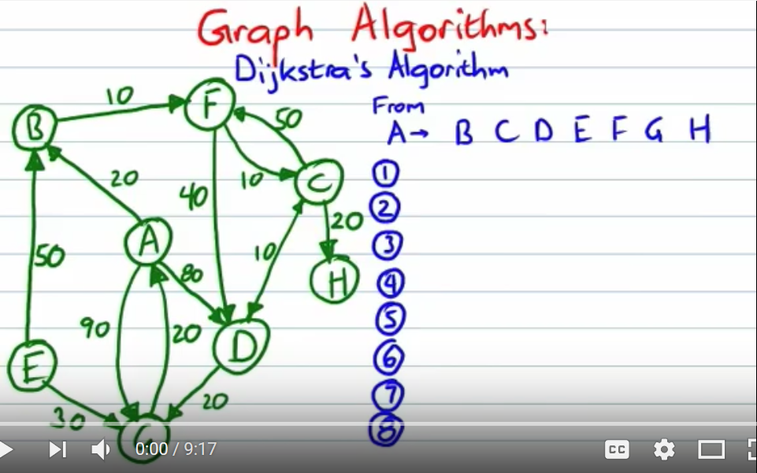

# DijkstraDemo

## Sample Run 1: Quiz 2 Number 23
```
run:
Adjacency list: 
S: {A=4, B=3, D=7}
A: {C=1}
B: {S=3, D=4}
C: {D=3, E=1}
D: {T=3, E=1, F=5}
E: {T=4, G=2}
F: {}
G: {T=3, E=2}
T: {F=5}
[S, A, B, C, D, E, F, G, T]
Initialization: [0, 2147483647, 2147483647, 2147483647, 2147483647, 2147483647, 2147483647, 2147483647, 2147483647]
Path from S to S is S : Length = 0
[0, 4, 3, 2147483647, 7, 2147483647, 2147483647, 2147483647, 2147483647]
Path from S to B is SB : Length = 3
[0, 4, 3, 2147483647, 7, 2147483647, 2147483647, 2147483647, 2147483647]
Path from S to A is SA : Length = 4
[0, 4, 3, 5, 7, 2147483647, 2147483647, 2147483647, 2147483647]
Path from S to C is SAC : Length = 5
[0, 4, 3, 5, 7, 6, 2147483647, 2147483647, 2147483647]
Path from S to E is SACE : Length = 6
[0, 4, 3, 5, 7, 6, 2147483647, 8, 10]
Path from S to D is SD : Length = 7
[0, 4, 3, 5, 7, 6, 12, 8, 10]
Path from S to G is SACEG : Length = 8
[0, 4, 3, 5, 7, 6, 12, 8, 10]
Path from S to T is SACET : Length = 10
[0, 4, 3, 5, 7, 6, 12, 8, 10]
Path from S to F is SDF : Length = 12
[0, 4, 3, 5, 7, 6, 12, 8, 10]
BUILD SUCCESSFUL (total time: 0 seconds)
```

## Sample Run 2: Testing distanceedjohn Dijkstra Demo (https://youtu.be/8Ls1RqHCOPw)


```
run:
Adjacency list: 
A: {B=20, D=80, G=90}
B: {F=10}
C: {D=10, F=50, H=20}
D: {C=10, G=20}
E: {B=50, G=30}
F: {C=10, D=40}
G: {A=20}
H: {}
[A, B, C, D, E, F, G, H]
Initialization: [0, 2147483647, 2147483647, 2147483647, 2147483647, 2147483647, 2147483647, 2147483647]
Path from A to A is A : Length = 0
[0, 20, 2147483647, 80, 2147483647, 2147483647, 90, 2147483647]
Path from A to B is AB : Length = 20
[0, 20, 2147483647, 80, 2147483647, 30, 90, 2147483647]
Path from A to F is ABF : Length = 30
[0, 20, 40, 70, 2147483647, 30, 90, 2147483647]
Path from A to C is ABFC : Length = 40
[0, 20, 40, 50, 2147483647, 30, 90, 60]
Path from A to D is ABFCD : Length = 50
[0, 20, 40, 50, 2147483647, 30, 70, 60]
Path from A to H is ABFCH : Length = 60
[0, 20, 40, 50, 2147483647, 30, 70, 60]
Path from A to G is ABFCDG : Length = 70
[0, 20, 40, 50, 2147483647, 30, 70, 60]
Path from A to [E] not found.
BUILD SUCCESSFUL (total time: 0 seconds)
```


## Sample Run 3: Testing Joe James Dijkstra Demo (https://youtu.be/k1kLCB7AZbM)

```
run:
Adjacency list: 
S: {A=2, D=20}
A: {E=3}
B: {C=7}
C: {F=5}
D: {}
E: {B=1, G=6, H=4}
F: {B=0}
G: {D=2}
H: {E=2, G=1}
[S, A, B, C, D, E, F, G, H]
Initialization: [0, 2147483647, 2147483647, 2147483647, 2147483647, 2147483647, 2147483647, 2147483647, 2147483647]
Path from S to S is S : Length = 0
[0, 2, 2147483647, 2147483647, 20, 2147483647, 2147483647, 2147483647, 2147483647]
Path from S to A is SA : Length = 2
[0, 2, 2147483647, 2147483647, 20, 5, 2147483647, 2147483647, 2147483647]
Path from S to E is SAE : Length = 5
[0, 2, 6, 2147483647, 20, 5, 2147483647, 11, 9]
Path from S to B is SAEB : Length = 6
[0, 2, 6, 13, 20, 5, 2147483647, 11, 9]
Path from S to H is SAEH : Length = 9
[0, 2, 6, 13, 20, 5, 2147483647, 10, 9]
Path from S to G is SAEHG : Length = 10
[0, 2, 6, 13, 12, 5, 2147483647, 10, 9]
Path from S to D is SAEHGD : Length = 12
[0, 2, 6, 13, 12, 5, 2147483647, 10, 9]
Path from S to C is SAEBC : Length = 13
[0, 2, 6, 13, 12, 5, 18, 10, 9]
Path from S to F is SAEBCF : Length = 18
[0, 2, 6, 13, 12, 5, 18, 10, 9]
BUILD SUCCESSFUL (total time: 0 seconds)
```
